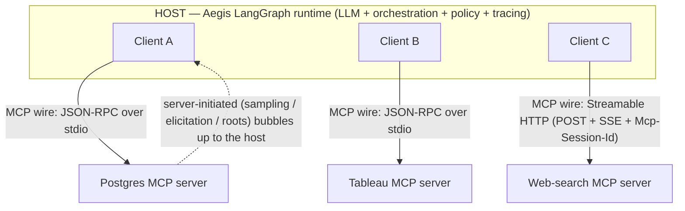

# Primer: MCP — Host, Client, Server (and the two boundaries)

The Model Context Protocol (MCP) is Anthropic's open standard that lets an LLM application call
external tools/data through a **uniform contract** instead of brittle, hardcoded integrations
(Aegis principle P7; requirement FR-MCP-1). This primer captures the architecture — especially the
distinction people most often miss: **MCP has two boundaries, and only one of them is a wire protocol.**

## The problem it solves

Without MCP, every tool (Postgres, Tableau, web search) is a bespoke, hardcoded integration inside
the agent. MCP replaces those with a standard JSON-RPC contract: any server that speaks MCP can be
plugged into any host that speaks MCP — tools become swappable, not welded in.

## The three roles

- **Host** — the LLM application: owns the model, the user interaction, orchestration, and **policy /
  consent / logging**. In Aegis this is the **LangGraph agent runtime**.
- **Client** — a protocol connector living *inside* the host. **Exactly 1:1 with one server.** Three
  servers → three clients. Its job: faithfully relay + isolate one connection.
- **Server** — the external program exposing tools/resources/prompts (e.g. our Postgres MCP server).

## The two boundaries (the key idea)

| Boundary | What it is | Protocol? |
|---|---|---|
| **Host ↔ Client** | in-process API within one application/trust domain — method calls + registered callbacks | **No wire protocol.** MCP does not specify it; it's an SDK concern. |
| **Client ↔ Server** | the JSON-RPC 2.0 conversation MCP standardizes | **Yes** — over a transport (stdio or Streamable HTTP). |

So the host never "speaks MCP over the wire." It calls a **client object** (`client.list_tools()`,
`client.call_tool(...)`) that speaks MCP on its behalf. All the POST + SSE + session-id machinery
lives strictly on the client↔server hop; the host is unaware of which transport a client even uses.

## Client ↔ Server transports & statefulness

- **stdio** — one long-lived process, one client, messages over stdin/stdout. **One process = one
  implicit session**; state is just process memory. Simplest; what Aegis uses for the local Postgres
  server.
- **Streamable HTTP** — a single endpoint. Client **POST**s JSON-RPC; the server replies either with
  one JSON response or an **SSE stream** (progress/notifications/server-requests, then the result).
  An optional **GET** opens a standalone server→client SSE stream.
  - **Statefulness is decoupled from the connection.** On `initialize` the server may return an
    **`Mcp-Session-Id`** header; the client echoes it on every subsequent request, and the server
    keys per-session state by it. No session id → **stateless** (each request independent). SSE `id:`
    + `Last-Event-ID` enables stream **resumption**. (This replaced the older 2024 HTTP+SSE transport
    where the persistent connection *was* the session — fragile, non-resumable.)
  - **Scaling note:** stateful HTTP servers need sticky-routing by session id or an externalized
    session store (e.g. Redis); stateless mode sidesteps that.

## Server-initiated flows — why the host↔client split matters

Some requests go **server → client → host**, because only the host owns an LLM and a user:

- **Sampling** — a server requests an LLM completion; the client can't fulfill it, so it invokes a
  **handler the host registered**, the host runs its model (with consent) and returns the result.
- **Elicitation** — a server asks the *user* for input; relayed up to the host's UI.
- **Roots** — the host declares which resource roots are in scope, pushed down to servers.

Mechanically these are in-process **callbacks**: the host *drives* the client (connect/list/call)
**and services callbacks** from it. That's the whole reason the boundary is where it is.

## Where MCP sits in Aegis

- **FR-MCP-1:** agents query the Postgres ledger through a **parameterized** MCP tool over JSON-RPC
  (`run_audit_query`). FR-MCP-2: a Tableau MCP tool. Module 4 (§11.4).
- The **host is the trust/policy boundary**: it enforces the data-classification gate (P1, NFR-GOV),
  logs every tool call (NFR-OBS / FR-AG-2), and *authorizes* what the model proposes. The **client**
  is a dumb, isolated pipe; the **server** is a security-scoped tool.
- **Security boundary (carried from Exercise 03):** an MCP tool hands query power to an *LLM*, so the
  tool is an untrusted-input boundary — **parameterized queries, a read-only DB role, and query
  allow-listing** are mandatory, not optional. "The LLM chose the query" must never mean "the LLM ran
  arbitrary SQL."

## How we'll learn it (see BACKLOG WI-9 / WI-10)

We pull a focused **Postgres MCP module** forward right after the Phase 1 `src/` data build (the
ledger is ready, the injection lesson fresh). We build **all three roles** — a host handler, a client,
and the server — on **stdio** first, then a short **Streamable HTTP + `Mcp-Session-Id`** exercise to
feel the stateful-session mechanics, testing with the MCP Inspector / a tiny client (no agent graph
needed yet).
